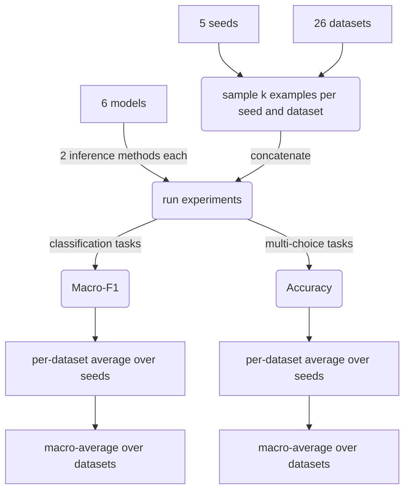
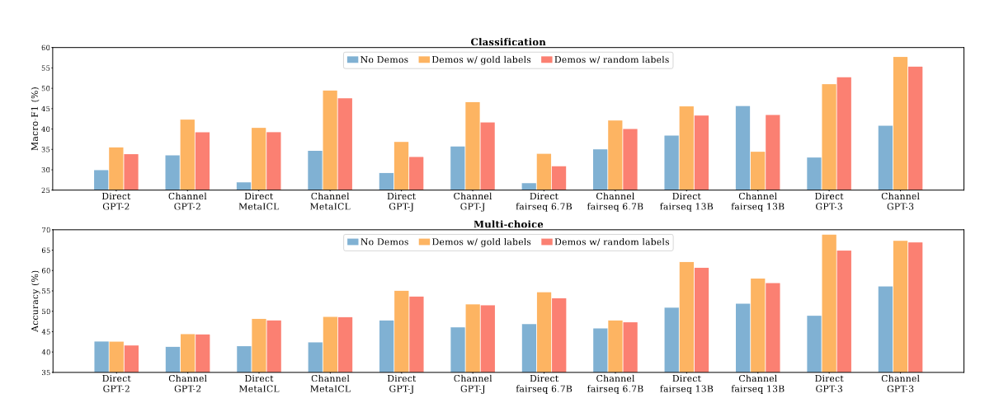
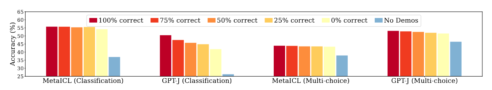
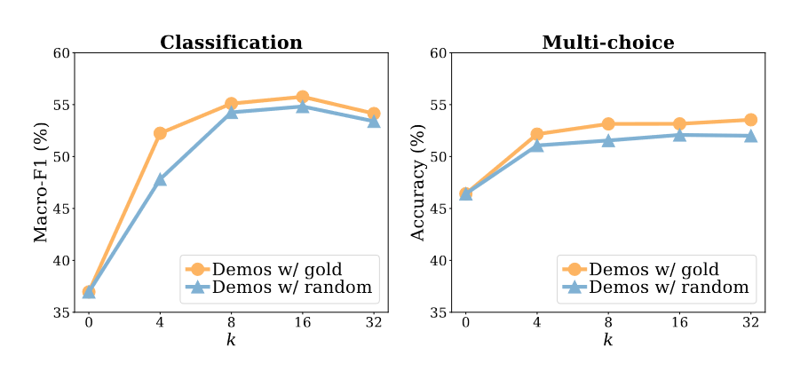
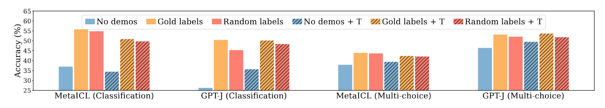
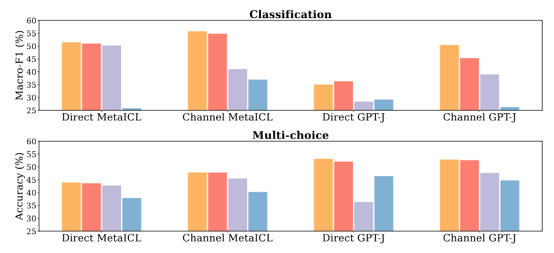
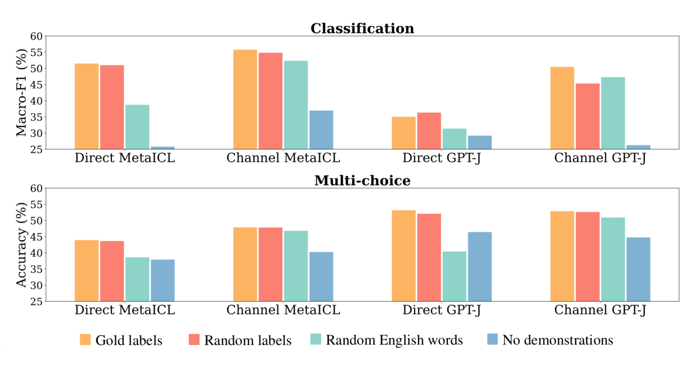
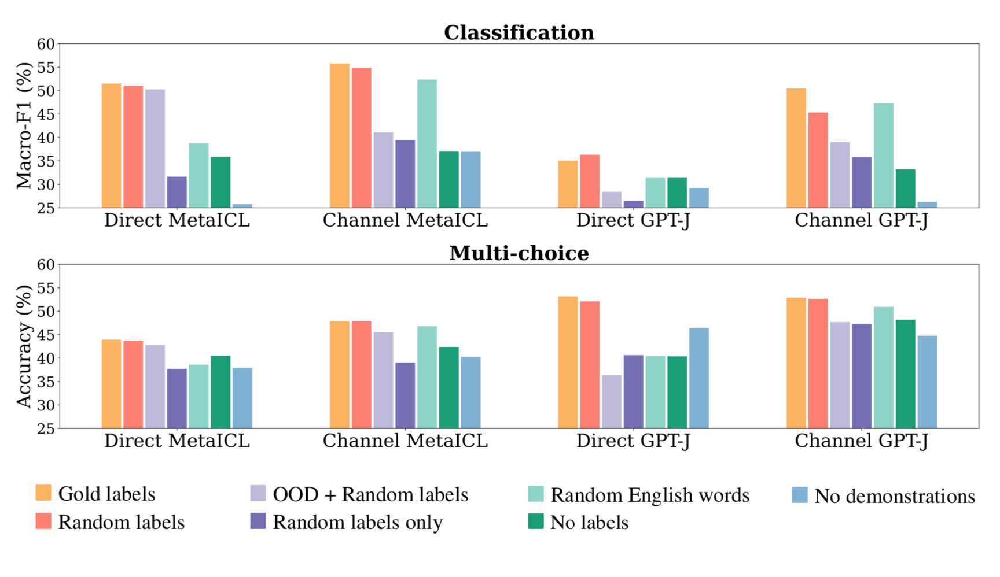

# Ground Truth _Kinda_ Matters - About the In's and Out's of In-Context Learning

## Introduction: In-context learning

With LLMs being all the rage currently, one big question is: how do we use them? Instead of small models trained to do a specific task, we now also have language models with billions of parameters that can be used for many different tasks. 

One way to get a language model to do a certain task is...

>[!basic]  In-context learning (ICL)
>The basic idea behind in-context learning is to give a language model a few examples of inputs and corresponding outputs before letting it predict the outputs for new inputs.
>Intuitively, the examples demonstrate the task in hopes of the model generalizing from them to do the task (better).

Now that you know what in-context learning is, we can dive into the main parts of this post. There are two parts, each of them breaking down one paper. Both try to answer the question of **how and why in-context learning works**. By the end, you hopefully have gained a better understanding of what goes into in-context learning and how the authors of the papers studied this.

-----
## Part 1: "Ground Truth Matters Little"

The main paper this post focuses on is called "Rethinking the role of demonstrations: What makes in-context learning work?"[^1]. It came out in early 2022 and was one of the first to explore how and why in-context learning works.

Here's an overview showing you what to expect in this first part:
1. [Details about the experiments](#Details%20about%20the%20experiments)
2. [Gold labels vs random labels](#Gold%20labels%20vs%20random%20labels)
3. [What does not matter for ICL?](#What%20does%20not%20matter%20for%20ICL?)
4. [What makes ICL work then?](#Ok,%20but%20...what%20makes%20ICL%20work%20then?)
5. [Recap and Discussion](#Recap%20and%20Discussion)
### Details about the experiments
#### Models
The authors used these 6 different LLMs in their experiments:

| Name                | Parameters | Good to know                                                      | Links                                                                                                                                                                                                                                          |
| ------------------- | ---------- | ----------------------------------------------------------------- | ---------------------------------------------------------------------------------------------------------------------------------------------------------------------------------------------------------------------------------------------- |
| GPT-2 Large         | 774M       |                                                                   | [Paper](https://insightcivic.s3.us-east-1.amazonaws.com/language-models.pdf), [PapersWithCode](https://paperswithcode.com/paper/language-models-are-unsupervised-multitask), [Huggingface](https://huggingface.co/openai-community/gpt2-large) |
| MetaICL             | 774M       | fine-tuned on in-context learning, based on GPT-2 Large           | [Paper](https://aclanthology.org/2022.naacl-main.201/), [PapersWithCode](https://paperswithcode.com/paper/metaicl-learning-to-learn-in-context)                                                                                                |
| GPT-J               | 6B         | open-source replication of GPT-3                                  | [GitHub](https://github.com/kingoflolz/mesh-transformer-jax), [Huggingface](https://huggingface.co/EleutherAI/gpt-j-6b)                                                                                                                        |
| fairseq             | 6.7B       |                                                                   | [Paper](https://arxiv.org/pdf/2112.10684.pdf), [GitHub](https://github.com/facebookresearch/fairseq/tree/main/examples/moe_lm), [Huggingface](https://huggingface.co/KoboldAI/fairseq-dense-6.7B)                                              |
| fairseq             | 13B        | largest publicly released dense LM at the time; developed by Meta | [Paper](https://arxiv.org/pdf/2112.10684.pdf), [GitHub](https://github.com/facebookresearch/fairseq/tree/main/examples/moe_lm), [Huggingface](https://huggingface.co/KoboldAI/fairseq-dense-13B)                                               |
| GPT-3, davinci-base | 175B       | largest dense LM at the time                                      | [Paper](https://arxiv.org/abs/2005.14165), [PapersWithCode](https://paperswithcode.com/paper/language-models-are-few-shot-learners), [GitHub](https://github.com/openai/gpt-3)                                                                 |
Each of this models was used with with two different inference methods, **direct** inference and **noisy channel** inference.

>[!btw] Direct vs Noisy Channel [^3]
>The difference between these two inference methods lies in the calculated probabilities.
>
>**Direct** models simply calculate $P(output | input)$, so we are trying to find the output with the largest probability given the input.
>
>**Noisy channel** models take a slightly different approach: they try to maximize $P(input | output)P(output)$. Intuitively, the noisy channel method assumes that the input contains some noise, and that the goal is to reconstruct the version without noise - the output. This is more often used in areas where this intuition comes more naturally, like transcriptions or machine translations.
>
>You may be able to see how these probabilities easily relate to each other via Bayes' rule. A nice advantage of the noisy channel method is that it splits the probability into two parts, and the second part, $P(output)$, can often be modelled independently from the task at hand. 
>
#### Datasets
The 26 datasets used in the experiments cover a wide variety of domains, with a focus on smaller datasets that pass the [GLUE](https://gluebenchmark.com/) and [SuperGLUE](https://super.gluebenchmark.com/) benchmarks. There are two types of tasks:
1. classification, e.g. sentiment analysis
2. multi-choice, e.g. question answering
#### Procedure
The researchers arrived at a single combined score per model and task type with the following procedure:

First, they used 5 seeds to sample $k$ examples from each dataset (default: $k=16$), and each set of $k$ examples was concatenated. Then, each model was fed the example sets to make its predictions, one for each example set and inference method. The performance was then calculated as an average over the seeds and over the datasets.

If you're thinking: "That's a LOT of examples and runs", you'd be exactly right. That is why for the two largest models, they only used a subset of 6 datasets and 3 random seeds.

Now that we went over the setup, we are ready to dive into the different experiments and see what the results were!
### Gold labels vs random labels
The main experiments in the paper focused on comparing the following three approaches:

1. **<b>no demonstrations</b>**: a baseline without in-context learning, which means the model is not given any examples of input-output pairs
2. <b>demonstrations with gold labels</b>: your usual in-context learning approach, in which the model is given *k* examples of inputs with their corresponding correct labels
3. <b>demonstrations with random labels</b>: an approach where the model is given *k* examples just like in the previous approach, but the inputs are paired with randomly sampled labels

This graph shows the performance of each model with each of the 3 approaches for each task category (classification and multi-choice):

**It seems that using random labels in the examples works pretty much almost as well as using random labels!** This is already the main point of this paper. The authors admit that this is unexpected, because - well, shouldn't the information that certain inputs produce certain outputs matter? Why else should we even give examples in the first place?

To try and answer these questions, the paper presents a whole bunch of further experiments. First, we will look at some smaller ablations of the main experiment, and then explore what else might be hidden in the examples that helps models learn in-context.
### What does not matter for ICL?

The following three experiments help investigate the main results. They were conducted on a smaller scale, using only the two best models (MetaICL and GPT-J) and 9 datasets (I'm sure the GPUs involved were grateful 🙏).
##### 1. Does it matter *how many* correct labels are used?

One thing about the random labels method is that it is, well, random. In fact, the labels are sampled uniformly from _all_ labels - which includes the correct ones. This means that there is a small chance that the some, or even most of the random labels are correct. Naturally, the comparison to the gold labels would not be as meaningful in that case.

The first ablation addresses this issue by using a range of fixed percentages of correct labels. 

The main takeaway here is: using examples with all wrong labels still seems to produce noticeably better results than the no-example baseline. Also, the MetaICL model seems to be especially robust in this aspect.
##### 2. Does the number of examples matter?

As noted earlier, each experiment run used $k=16$ examples. But especially with larger models, using long inputs can become vey costly %%TODO: source?%%. The second ablation therefore aims to see whether we really need that many examples to achieve the performance increases we've seen.
%%TODO: models?%%

According to these results, increasing the number of examples beyond 8 does not really improve performance.
##### 3. Does the way in which the examples are presented matter?

In the main experiments, the examples were simply concatenated without any additional context or structure. For the third ablation, the authors used what they describe as different templates for the examples.

Instead of just presenting the inputs and outputs, these templates are a way to add context and structure using short phrases or keywords that describe how inputs and outputs are related.

Here are some examples, taken from the paper's appendix, to show you the difference in how these templates present the inputs and outputs:

> What blocks sunshine? \\n {summer|park|desktop|sea|moon}
> The question is: What blocks sunshine? \\n The answer is: {summer|park|desktop|sea|moon}

> Effect: I coughed. \\n {Cause: I inhaled smoke.|Cause: I lowered my voice.}
> I coughed because {I inhaled smoke.|I lowered my voice.}

As for the results: the use of special templates did not really make a difference in these experiments, and in some cases the performance even decreased:

Another paper[^4] that came out just this year actually focused on the question of what templates work best. They came to the conclusion that it really depends on the entire setup including the data, model, and examples - so it seems to be a very delicate and complex issue. If that is true, the experiment results here make a lot of sense, because they are averaged over examples and datasets.

So, according to these experiments, ICL seems to work even with fewer examples that have completely wrong labels and have little structure apart from simple concatenation of inputs and outputs. Which brings us to the question...
### What makes ICL work then?

If the examples don't have the correct labels but still help improve performance, there must be something else that the models can extract from them. The authors of the paper identified four elements that examples in an ICL setting contain:

>[!basic] Information in ICL examples
>1. input-label mapping
>2. distribution of input text
>3. label space
>4. format

The first one, input-label mapping, is the only aspect that had been removed in the experiments with the random/wrong labels. As for the other three, the paper presents - you guessed it! - more experiments to see which of them are actually needed to make ICL work.
##### Distribution of input text
First up is the distribution of input text, meaning: what typical inputs from the dataset look like. 
%%For us humans, it is easy to distinguish casual phrasings used in social media from more formal and sophisticated language seen in e.g. newspaper articles, and we can also make %%
To see how important this is, the authors conducted experiments where they used example inputs from a different corpus (out-of-distribution demos) than the final input/question for which the model is asked to choose a label.

The out-of-distribution examples lead to noticeably weaker performance, with the exception of direct inference with the MetaICL model.  %%The authors hypothesize that TODO: make task closer to language modeling]%%
##### Label space
Similarly to how the examples show typical inputs for a task, they also show typical labels. To study the impact of this, the next experiment used random English words instead of the actual labels. There are two levels of randomization here: the words are randomly sampled, assigned to the original labels and then randomly matched with inputs.

Apparently, there is a clear difference in trends between inference methods. For direct inference, there is a big performance drop, so having the correct label space represented in the examples seems to be very important for this type of inference. For the channel inference, the impact is much smaller. According to the authors, this is probably because this method only uses the labels for conditioning - so the model doesn't have to estimate the conditional probability of a label that it hasn't seen. 
##### Format
The most basic aspect of the examples is simply the fact that they are pairs of inputs and outputs. This is what is meant by the format. The variations used to look into whether this format is important for ICL performance were examples that left out either the inputs or the labels.

The aim here was to see how using only inputs or only labels in the demonstrations compares to using both components, with the only difference being the format itself. Things like the input distribution or the label space are additional information separate to the format itself, so the most interesting comparisons here - apart from the baseline without examples - are how using no inputs compares to using OOD inputs, and how using no labels compares to using random words as labels.

With both variants (no inputs and no labels), we see much weaker performance overall. Especially in the classification tasks (upper part of the figure), the format seems to make a large difference in settings where having OOD inputs or random words as labels achieved good performance. It looks like **the format is very important**!
### Recap and Discussion

>[!basic] Part 1: Main results
>1. specifying the input and label spaces is what's most important for better 
>    performance using ICL
>2. having only the right input distribution or label set still improves performance, 
>   as long as the format is right
>3. all of the trends were especially strong for the MetaICL model, which was fine-tuned
>   for in-context learning

These results have some pretty cool implications - for instance, if we only need the right input distribution and format to do in-context learning, then we can do it with unlabeled data too! %%TODO: more here?%%

In a simpler (maybe also: more boring) world, this would be it - hooray, we don't need ground truth labels for in-context learning. But we obviously want to be diligent and honest when doing our research. That includes being aware and transparent about limitations. In this case, the authors mention the following:
1. they only used datasets with natural language inputs
2. they macro-averaged over all datasets
3. they focused on classification and multi-choice tasks only

This brings us to...

-----
## Part 2: "Ground Truth Labels Matter"

The paper we've seen in the first part presented a result with quite bold implications - namely that using examples with correct labels isn't that important when doing in-context learning. There were also multiple limitations that the authors admitted - which brings us to the second paper I'd like to show you.

While doing my research on the first paper and browsing newer papers that cited it, this one in particular jumped out to me, because the title already made it clear that it is a direct response to the original paper: *"Ground-Truth Labels Matter: A Deeper Look into Input-Label Demonstrations"*[^2]. 
They mentioned two main limitations of the first paper:
1. the averaging across datasets
2. the fact that apart from the general performance measures, there was no quantification of the impact that (not) using ground-truth labels had

To address this, the authors of this second paper came up with two new metrics and replicated all the experiments in the first paper with an improved setup.

The two newly introduced measures are:

>[!basic] Label-correctness sensitivity
>This measure expresses how much the performance changes with a certain amount of labels being corrupted - basically: the coefficient of the linear regression that relates the performance measure to the percentage of correctly labelled examples.

>[!basic] Ground-truth label effect ratio (GLER)
>This metric is best expressed as:
 $$GLER=\frac{\text{ground truth performance} - \text{random label performance}}{\text{ground truth performance} - \text{no-demo performance}}$$
#### Results and ablations
We've already looked at many experiments and many graphs, so I'm just going to quickly summarize the main results.

The average label-correctness sensitivity was 0.309 - which means that for each percentage of incorrect labels in examples, the performance measure dropped 0.309%. So for 100% incorrect labels, this result would imply that performance would drop about 30%!
This number also varies a lot across datasets/tasks, so once again, there seem to be other factors at play. One of those factors seems to be task difficulty, which is also analyzed in the paper - in short, low sensitivity is apparently related to low performance in general. Additionally, noisy channel inference reduces sensitivity, while the number of examples and model size lead to an increase.

Finally, they also did some more ablations, with one being especially interesting:
##### Prior-free labels
If you think (or scroll 😎) back to the 4 aspects represented in ICL examples, there are two that involve the labels: the input-label mapping and the label space. There was one experiment in the first paper where the labels were replaced with random English words in such a way that not only was the set of labels a bunch of random words, but those new labels were also randomly assigned to inputs. But what if the original labels were mapped to random words and simply replaced without randomizing? In other words, what if the input-label mapping was preserved with other labels?

This is what the authors of the second paper tried to answer with an experiment using **prior-free** labels, meaning labels that don't contain any information about what they mean (e.g. "Positive", "Hate"). Their results indicate that using these kinds of labels does lead to better performance than random mappings, especially when using simple letters or numbers.
%%##### Different label distributions
There is one other factor concerning the labels, apart from what the set of labels looks like and how they are mapped to individual examples, namely: the overall distribution of labels. When drawing examples from an imbalanced dataset, chances are that the examples represent the label distribution in that dataset. But if we just randomly assign labels to our examples, that is probably no longer the case. In their experiments, the authors found that using demonstrations with a balanced label distribution does in fact decrease the sensitivity, the GLER and the accuracy.%%

All in all:

>[!basic] Part 2: Main result
>having the correct input-label mappings does make a performance difference, on some datasets more than on others
 
-----
## Recap

Let's recap: input-label mappings do seem to matter for ICL demonstrations - **but** not always as much as one would think. Also: there is a lot more that goes into in-context learning than just showing a model how inputs relate to outputs. There's many more factors, both on the example level, like the input/label spaces and the format, and in terms of the broader setup, like the model size, model meta-training, dataset, or inference method. In a sense, **it depends on the context**.

The papers are two years old as this is being written, so there is already a lot of new research on how to do in-context learning and why it works. Here are some more interesting papers I found, if you are motivated to do more reading:
- [how larger models perform with incorrect or prior-free labels](https://arxiv.org/abs/2303.03846)[^8]
- [a survey about ICL in general from 2023](https://arxiv.org/abs/2301.00234)[^5]
- [a survey about using retrieved demonstrations in ICL, i.e. choosing specific demonstrations for an input](https://arxiv.org/abs/2401.11624)[^6]
- [a paper about privacy in ICL](https://arxiv.org/abs/2305.01639)[^7]

I hope you've learned a thing or two about in-context learning and understood the main ideas from the two papers.

-----
## References

[^1]:  Min, S., Lyu, X., Holtzman, A., Artetxe, M., Lewis, M., Hajishirzi, H., & Zettlemoyer, L. (2022a). Rethinking the role of demonstrations: What makes in-context learning work? _arXiv Preprint arXiv:2202.12837_. [https://arxiv.org/abs/2202.12837](https://arxiv.org/abs/2202.12837)
[^3]: Min, S., Lewis, M., Hajishirzi, H., & Zettlemoyer, L. (2022). Noisy channel language model prompting for few-shot text classification. _Proceedings of the 60th Annual Meeting of the Association for Computational Linguistics Volume 1: Long Papers_, 5316–5330. [https://aclanthology.org/2022.acl-long.365.pdf](https://aclanthology.org/2022.acl-long.365.pdf)
[^2]: Yoo, K. M., Kim, J., Kim, H. J., Cho, H., Jo, H., Lee, S.-W., Lee, S., & Kim, T. (2022). _Ground-truth labels matter: A deeper look into input-label demonstrations_. [https://arxiv.org/abs/2205.12685](https://arxiv.org/abs/2205.12685)
[^4]: Voronov, A., Wolf, L., & Ryabinin, M. (2024). _Mind your format: Towards consistent evaluation of in-context learning improvements_. [https://arxiv.org/abs/2401.06766](https://arxiv.org/abs/2401.06766)
[^5]: Dong, Q., Li, L., Dai, D., Zheng, C., Wu, Z., Chang, B., Sun, X., Xu, J., Li, L., & Sui, Z. (2023). _A survey on in-context learning_. [https://arxiv.org/abs/2301.00234](https://arxiv.org/abs/2301.00234)
[^6]: Xu, X., Liu, Y., Pasupat, P., Kazemi, M., & others. (2024). In-context learning with retrieved demonstrations for language models: A survey. _arXiv Preprint arXiv:2401.11624_. https://arxiv.org/abs/2401.11624
[^7]: Panda, A., Wu, T., Wang, J. T., & Mittal, P. (2023). Differentially private in-context learning. _arXiv Preprint arXiv:2305.01639_. https://arxiv.org/abs/2305.01639
[^8]: Wei, J., Wei, J., Tay, Y., Tran, D., Webson, A., Lu, Y., Chen, X., Liu, H., Huang, D., Zhou, D., & others. (2023). Larger language models do in-context learning differently. _arXiv Preprint arXiv:2303.03846_. https://arxiv.org/abs/2303.03846